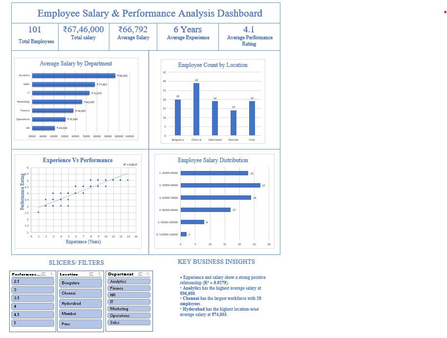

# Employee-Salary-Performance-Analysis
Excel data analysis project analyzing employee salary, performance, experience, and location using formulas, Pivot-tables, charts, and an interactive dashboard.

# Introduction 

This project analyzes employee salary, performance, experience, department, and location data using Microsoft Excel. The project demonstrates the complete analysis process from raw employee data and KPI analysis to Pivot-tables, charts, and an interactive dashboard.

## Project Objective

The objective of this project is to analyze employee data and identify patterns in salary, performance, experience, department, and location. The analysis also aims to present key findings through Pivot-tables, charts, and an interactive Excel dashboard.
## Dataset Overview

The dataset contains information for 101 employees across different departments and locations.
 Key Fields
- Employee ID
- Employee Name
- Department
- Location
- Salary
- Experience
- Performance Rating
- Joining Date
- Age
- Sales

## Tools & Excel Skills Used

- Microsoft Excel
- Excel Tables and Structured References
- IF, IFS, AND, OR
- COUNTIF, COUNTIFS, SUMIF, SUMIFS, AVERAGEIF, AVERAGEIFS
- XLOOKUP, VLOOKUP, INDEX & MATCH
- Text and Date Functions
- Data Validation
- Conditional Formatting
- Sorting and Filtering
- PivotTables and PivotCharts
- Slicers
- Charts and Trendlines
- KPI Analysis
- Interactive Dashboard
- Status

## Key Analysis Performed

- Department-wise employee count and salary analysis
- Department-wise experience and performance analysis
- Performance rating analysis across departments
- Experience group analysis
- Location-wise employee count and salary analysis
- Salary distribution analysis
- Salary vs Experience relationship analysis
- Salary vs Performance Rating relationship analysis
- Experience vs Performance relationship analysis
- Department workforce and salary contribution analysis

## Key Findings

- Analytics has the highest average salary at ₹96,600.
- Chennai has the largest workforce with 29 employees.
- Hyderabad has the highest average salary by location at ₹74,053.
- Employees with 10–13 years of experience have the highest average salary at ₹98,125.
- Average performance rating increases across the experience groups, reaching 5.0 for employees with 10–13 years of experience.
- Salary and experience show a strong positive relationship in the analysis.
- 68 employees have a performance rating of 4 or higher.

## Dashboard

The interactive Excel dashboard provides a visual summary of the employee dataset using KPI- cards, charts, and slicers.

### Dashboard Highlights
- Total Employees: 101
- Total Salary: ₹67,46,000
- Average Salary: ₹66,792
- Average Experience: 6 Years
- Average Performance Rating: 4.1
- Interactive filters for Department, Location, and Performance Rating

## Project Structure

The Excel workbook contains the following worksheets:

- **Raw Data** – Original employee dataset used for the analysis.
- **Analysis** – KPI calculations and detailed employee analysis.
- **Pivot_Tables** – Pivot-table-based analysis with charts and slicers.
- **Dashboard** – Interactive visual dashboard presenting the key findings.

 ## Conclusion

This project demonstrates my ability to clean, analyze, summarize, and visualize employee data using Microsoft Excel. By using formulas, Pivot-tables, charts, slicers, and an interactive dashboard, I transformed raw employee data into meaningful business insights.
